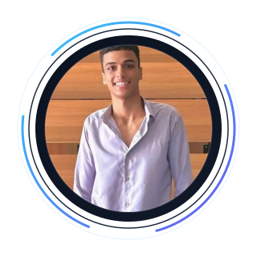

<table>
  <tr>
    <td width="62%" valign="middle">
      <h1>AI Products, Built Like a Startup</h1>
      
<strong>Adel Ibrahim</strong> builds open-source AI systems for education, collaboration, and professional growth.

      
From retrieval pipelines to productized learning platforms, the focus is simple: ship intelligent software that solves real-world problems and feels production-ready from day one.

      

        
        
        
      

      

        <a href="#product-showcase">Product Showcase</a> •
        <a href="#platform-capabilities">Platform Capabilities</a> •
        <a href="#architecture-highlights">Architecture Highlights</a> •
        <a href="#technology-showcase">Technology Showcase</a> •
        <a href="#connect">Connect</a>
      

    </td>
    <td width="38%" align="center" valign="middle">
      
    </td>
  </tr>
</table>

  
  
  
  

## Trust Signal

<table>
  <tr>
    <td width="68%" valign="top">
      <h3>First Place Winner • Computer Science &amp; Engineering Projects Exhibition 2026</h3>
      
<strong>Winning Product:</strong> ERTH Matching

      
Recognized for innovation, creativity, and technical excellence in building a collaboration platform with real product depth.

      

        
        
        
      

    </td>
    <td width="32%" align="center" valign="middle">
      
    </td>
  </tr>
</table>

## Platform Capabilities

<table>
  <tr>
    <td width="50%" valign="top">
      <h3>AI-Native Products</h3>
      
Learning systems, collaboration infrastructure, and communication platforms built around retrieval, orchestration, and user outcomes.

      

        
        
        
      

    </td>
    <td width="50%" valign="top">
      <h3>Founder-Style Execution</h3>
      
Product thinking, system architecture, and open-source delivery combined into software that feels more like a company homepage than a student portfolio.

      

        
        
        
      

    </td>
  </tr>
  <tr>
    <td width="33%" valign="top">
      <h3>Personalized Learning</h3>
      
Adaptive curriculum generation, topic dependency modeling, and guided next-step learning.

    </td>
    <td width="33%" valign="top">
      <h3>Collaboration Systems</h3>
      
Matching engines, workspace flows, role-based access, and project infrastructure.

    </td>
    <td width="34%" valign="top">
      <h3>Communication Intelligence</h3>
      
Retrieval-driven coaching, simulation loops, and domain-specific skill development.

    </td>
  </tr>
</table>

## Product Showcase

<table>
  <tr>
    <td width="100%" valign="top">
      <h3>ERTH Matching</h3>
      
<strong>Collaboration infrastructure for smarter team formation.</strong>

      

        
        
        
      

      
Designed as a multi-module platform for student matching, research team formation, project discovery, and workspace execution.

      <table>
        <tr>
          <td width="25%"><strong>70+</strong> API endpoints</td>
          <td width="25%"><strong>11</strong> core capabilities</td>
          <td width="25%"><strong>5+</strong> platform modules</td>
          <td width="25%"><strong>1</strong> award-winning release</td>
        </tr>
      </table>
      
<strong>Architecture highlights:</strong> matching engine • RBAC • chat and Kanban workflows • analytics dashboard • AI profile assistance

    </td>
  </tr>
</table>

<table>
  <tr>
    <td width="100%" valign="top">
      <h3>Erudios</h3>
      
<strong>Open-source curriculum intelligence for personalized AI learning.</strong>

      

        
        
        
        
      

      
Structured around dependency-aware topic graphs, retrieval, and generation to create learning paths that adapt to what a learner should study next.

      <table>
        <tr>
          <td width="25%"><strong>4</strong> core engines</td>
          <td width="25%"><strong>1</strong> knowledge graph layer</td>
          <td width="25%"><strong>1</strong> multi-LLM router</td>
          <td width="25%"><strong>1</strong> resource pipeline</td>
        </tr>
      </table>
      
<strong>Architecture highlights:</strong> graph-aware curriculum planner • retrieval layer • adaptive content generation • resource discovery pipeline

    </td>
  </tr>
</table>

<table>
  <tr>
    <td width="100%" valign="top">
      <h3>Corpus</h3>
      
<strong>Professional communication intelligence powered by retrieval and coaching loops.</strong>

      

        
        
        
      

      
Built to help technical professionals communicate with confidence through grounded retrieval, roleplay simulations, and personalized coaching.

      <table>
        <tr>
          <td width="25%"><strong>1</strong> RAG pipeline</td>
          <td width="25%"><strong>1</strong> reranking path</td>
          <td width="25%"><strong>1</strong> coaching engine</td>
          <td width="25%"><strong>3+</strong> learning modes</td>
        </tr>
      </table>
      
<strong>Architecture highlights:</strong> embedding search • cross-encoder reranking • coaching workflows • personalized curriculum • roleplay simulations

    </td>
  </tr>
</table>

## Architecture Highlights

<table>
  <tr>
    <td width="50%" valign="top">
      <h3>Retrieval Systems</h3>
      
Grounded generation through vector search, reranking, and structured context assembly.

      

        
        
        
      

    </td>
    <td width="50%" valign="top">
      <h3>Agentic Workflows</h3>
      
Task-aware orchestration across generation, routing, retrieval, and product actions.

      

        
        
        
      

    </td>
  </tr>
  <tr>
    <td width="50%" valign="top">
      <h3>Knowledge-Driven Learning</h3>
      
Topic dependency modeling, curriculum sequencing, and adaptive next-step generation.

    </td>
    <td width="50%" valign="top">
      <h3>Product Infrastructure</h3>
      
Authentication, RBAC, dashboards, workspaces, messaging, and production-minded app flows.

    </td>
  </tr>
</table>

## Technology Showcase

<table>
  <tr>
    <td width="25%" valign="top">
      <h3>AI / ML</h3>
      

         
         
         
        
      

    </td>
    <td width="25%" valign="top">
      <h3>Backend</h3>
      

         
         
         
        
      

    </td>
    <td width="25%" valign="top">
      <h3>Frontend</h3>
      

         
         
         
        
      

    </td>
    <td width="25%" valign="top">
      <h3>Infra / Data</h3>
      

         
         
         
        
      

    </td>
  </tr>
</table>

## Product Metrics

<table>
  <tr>
    <td width="20%" align="center"><strong>3</strong> flagship products</td>
    <td width="20%" align="center"><strong>70+</strong> API endpoints</td>
    <td width="20%" align="center"><strong>3</strong> problem domains</td>
    <td width="20%" align="center"><strong>1</strong> first-place award</td>
    <td width="20%" align="center"><strong>100%</strong> builder-led execution</td>
  </tr>
</table>

## GitHub Stats

  
  
  

## Open Source Philosophy

Open source is the fastest path from idea to shared infrastructure.  
I build in public to make ambitious AI systems easier to inspect, learn from, and extend.  
The mission is not just to ship products, but to lower the barrier to high-quality AI education, collaboration tooling, and intelligent software.

## Connect

<table>
  <tr>
    <td width="65%" valign="middle">
      <h3>Let’s Build Useful AI</h3>
      
Interested in AI products, open-source systems, education platforms, or collaboration infrastructure? Let’s connect.

      
<strong>Location:</strong> Egypt

    </td>
    <td width="35%" align="center" valign="middle">
        
        
      
    </td>
  </tr>
</table>
