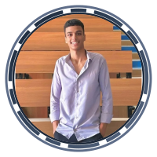
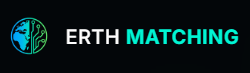
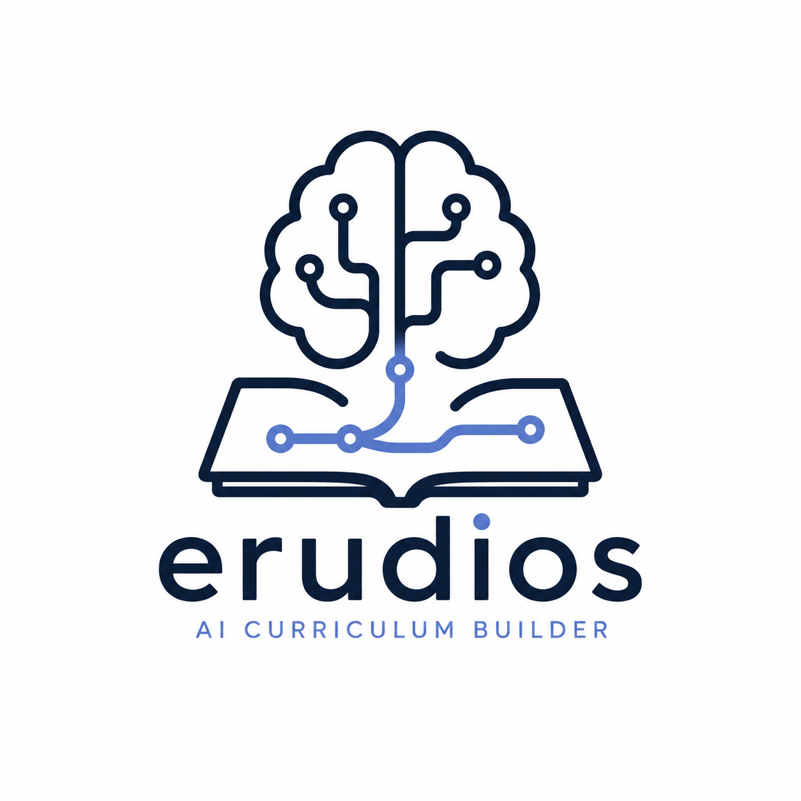
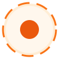
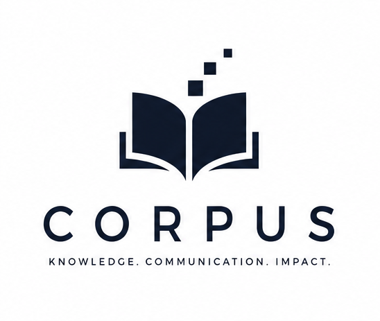

<table>
  <tr>
    <td width="62%" valign="middle">
      <h1 style="font-size: 3.2em; margin: 0 0 10px 0; color: #1C2839;">Adel Ibrahim</h1>
      <h2 style="font-size: 1.6em; margin: 0 0 20px 0; color: #2D3D52;">AI Science Student & Full-Stack Product Engineer</h2>
      <p style="font-size: 1.05em; color: #415169; margin-bottom: 15px; line-height: 1.6;">
        Hello everyone, I am Adel, a final-year AI Science student at the Faculty of Computer Science and Engineering, New Mansoura University, Egypt. I am deeply passionate about the entire spectrum of AI, machine learning, and large language models, my technical interests focus on Generative & Agentic AI, Natural Language Processing (NLP), LLM Orchestration, and robust System Architecture.
      </p>
      <p style="font-size: 1.05em; color: #415169; margin-bottom: 25px; line-height: 1.6;">
        I specialize in bridging the gap between theoretical AI research and practical product engineering—building cost-effective, production-grade, and smart full-stack systems.
      </p>
    </td>
    <td width="38%" align="center" valign="middle">
      
    </td>
  </tr>
</table>

## Trust Signal & Major Achievement

<table>
  <tr>
    <td width="100%" valign="top" style="border-left: 4px solid #1C2839; padding-left: 15px;">
      <h3 style="color: #1C2839; margin-top: 0;">First Place Winner — Computer Science & Engineering Projects Exhibition 2026</h3>
      <p style="color: #415169; font-size: 1.05em; line-height: 1.5;">
        Awarded by the <strong>College Administration of New Mansoura University</strong> for outstanding innovation, technical execution, and system architecture in building <strong>ERTH Matching</strong>. Developed as a high-performance, collaborative effort with my team.
      </p>
      <p>
        
        
        <a href="./Assets/certificate1.pdf">
          
        </a>
      </p>
    </td>
  </tr>
</table>

## Featured Projects

<table>
  <tr>
    <td width="100%" valign="top" style="padding: 15px;">
      <table width="100%" style="border: none; border-collapse: collapse; margin: 0 0 15px 0; padding: 0;">
        <tr style="border: none;">
          <td align="left" valign="middle" style="border: none; padding: 0;">
            <h3 style="color: #1C2839; margin: 0; font-size: 1.7em;">
              
              <span style="vertical-align: middle; font-weight: bold;">ERTH Matching</span>
            </h3>
          </td>
          <td align="right" valign="middle" style="border: none; padding: 0;">
            
            <span style="font-size: 0.75em; color: #15803D; font-weight: bold; text-transform: uppercase; letter-spacing: 0.5px; vertical-align: middle; background-color: #E8F5E9; padding: 4px 10px; border-radius: 12px; border: 1px solid #C8E6C9;">Completed</span>
          </td>
        </tr>
      </table>
      <p style="color: #415169; font-size: 1.05em; line-height: 1.5; margin-top: 10px;">
        A smart, skill-based collaboration and teammate matching engine for student projects, research papers, and academic work at New Mansoura University.
      </p>
      <p>
        
        
        
        
        
        
        
        
      </p>
      <strong style="color: #1C2839;">My Core Contributions & Product Ideation:</strong>
      <ul style="color: #415169; line-height: 1.5; margin-top: 5px; margin-bottom: 15px;">
        <li><strong>Software Testing & Quality Assurance:</strong> Structured and executed comprehensive testing plans to validate core features, access privileges, and system behaviors.</li>
        <li><strong>API Verification & Testing:</strong> Extensively checked and verified all 70+ REST API endpoints using Postman, writing automated assertions to ensure correct CSRF token exchanges and secure headers.</li>
        <li><strong>Product Development Ideation:</strong> Shared key ideas to design the product, driving the development of the daily schedule matrix, workspace workflows, and peer-review systems.</li>
      </ul>
      <strong style="color: #1C2839;">Platform Features (Team Collaboration):</strong>
      <ul style="color: #415169; line-height: 1.5; margin-top: 5px;">
        <li><strong>OTP Authentication & Security:</strong> Throttles access and secures registrations using domain-restricted email OTP verification (<code>@nmu.edu.eg</code>), CSRF token guards, and rate limiters.</li>
        <li><strong>Real-Time Workspaces:</strong> Features interactive Kanban task boards with custom sequence sorting, team group chats, and peer evaluation workflows.</li>
      </ul>
    </td>
  </tr>
</table>

<table>
  <tr>
    <td width="100%" valign="top" style="padding: 15px;">
      <table width="100%" style="border: none; border-collapse: collapse; margin: 0 0 15px 0; padding: 0;">
        <tr style="border: none;">
          <td align="left" valign="middle" style="border: none; padding: 0;">
            <h3 style="color: #1C2839; margin: 0; font-size: 1.6em;">
              
              <span style="vertical-align: middle; font-weight: bold;">Erudios</span>
            </h3>
          </td>
          <td align="right" valign="middle" style="border: none; padding: 0;">
            
            <span style="font-size: 0.78em; color: #EA580C; font-weight: bold; text-transform: uppercase; letter-spacing: 0.5px; vertical-align: middle; background-color: #FFF7ED; padding: 4px 10px; border-radius: 12px; border: 1px solid #FFEDD5;">In Progress</span>
          </td>
        </tr>
      </table>
      <p style="color: #415169; font-size: 1.05em; line-height: 1.5; margin-top: 10px;">
        An open-source, personalized learning platform that maps complex AI/ML taxonomies, builds prerequisite-aware dependency paths, and answers "what to learn next."
      </p>
      <p>
        
        
        
        
        
        
        
        
        <a href="https://github.com/xvadel/erudios">
          
        </a>
      </p>
      <strong style="color: #1C2839;">Key Technical Accomplishments:</strong>
      <ul style="color: #415169; line-height: 1.5; margin-top: 5px;">
        <li><strong>Topic Dependency Graphs:</strong> Developed a pre-built prerequisite taxonomy for 50+ AI/ML topics, utilizing custom graph-traversal algorithms to determine unlocked learning paths.</li>
        <li><strong>Token Budget Strategy:</strong> Optimized API expenses by routing requests between Gemini 2.0 Flash (deep generation) and Groq Llama 3.3 (classification), monitoring budgets via a Redis rate-limiting tracker.</li>
        <li><strong>Two-Tier Content Cache:</strong> Created a shared cross-user cache (Redis L1 + PostgreSQL L2), ensuring one user's generated learning path benefits all subsequent learners.</li>
        <li><strong>Lazy Generation Pipeline:</strong> Designed a staggered content generation flow (Shell → Sections → Interactive Quizzes), minimizing model calls to only what the user actively views.</li>
        <li><strong>Resource Discovery:</strong> Built a trust-scoring research engine that queries DuckDuckGo and OpenAlex to fetch and rank academic papers and articles.</li>
      </ul>
    </td>
  </tr>
</table>

<table>
  <tr>
    <td width="100%" valign="top" style="padding: 15px;">
      <table width="100%" style="border: none; border-collapse: collapse; margin: 0 0 15px 0; padding: 0;">
        <tr style="border: none;">
          <td align="left" valign="middle" style="border: none; padding: 0;">
            <h3 style="color: #1C2839; margin: 0; font-size: 1.6em;">
              
              <span style="vertical-align: middle; font-weight: bold;">Corpus</span>
            </h3>
          </td>
          <td align="right" valign="middle" style="border: none; padding: 0;">
            
            <span style="font-size: 0.78em; color: #EA580C; font-weight: bold; text-transform: uppercase; letter-spacing: 0.5px; vertical-align: middle; background-color: #FFF7ED; padding: 4px 10px; border-radius: 12px; border: 1px solid #FFEDD5;">In Progress</span>
          </td>
        </tr>
      </table>
      <p style="color: #415169; font-size: 1.05em; line-height: 1.5; margin-top: 10px;">
        A self-hostable domain-specific language learning platform that bridges the gap between technical mastery and professional communication in high-stakes environments.
      </p>
      <p>
        
        
        
        
        
        
        
        
      </p>
      <strong style="color: #1C2839;">Key Technical Accomplishments:</strong>
      <ul style="color: #415169; line-height: 1.5; margin-top: 5px;">
        <li><strong>Two-Stage RAG Pipeline:</strong> Built a hybrid retrieval pipeline combining Bi-Encoder candidate recall (<code>BAAI/bge-small-en-v1.5</code> in ChromaDB) and Cross-Encoder precision reranking (<code>BAAI/bge-reranker-base</code>), achieving a **+13.3% Recall@1** and **+15.0% Recall@3** increase over vector-only baselines.</li>
        <li><strong>Exponential Moving Average (EMA) Mastery:</strong> Programmed a SQLite-backed user skill tracker that calculates concept mastery dynamically based on real-time feedback loops.</li>
        <li><strong>GapAnalyzer Curriculum Engine:</strong> Implemented topological sorting over a 108-concept AI ontology to generate customized learning paths targeting verified vocabulary gaps.</li>
        <li><strong>Interactive AI Coaches:</strong> Designed roleplay simulators mimicking high-stakes scenarios, featuring startup VC pitches (Alex Mercer), principal systems designs (Sarah Connor), and AI architecture reviews (Dr. Evelyn Vance).</li>
      </ul>
    </td>
  </tr>
</table>

## Typical System Architecture (My RAG & AI Blueprint)

Here is a system blueprint representing the modular, cost-efficient architecture pattern I design for AI-native applications (implemented in **Erudios** and **Corpus**):

```text
┌──────────────────────────────────────────────────────────────────┐
│                             FRONTEND                             │
│       Next.js 15 (App Router) / Svelte 5 / React 19 / Vite       │
└────────────────────────────────┬─────────────────────────────────┘
                                 │
                                 │ JSON API Requests (CORS & CSRF Secured)
                                 ▼
┌──────────────────────────────────────────────────────────────────┐
│                           BACKEND API                            │
│                 FastAPI (Python 3.11) / PHP 8.2                  │
└─────────┬──────────────────────┬──────────────────────┬──────────┘
          │                      │                      │
          │ Cache Lookup         │ Hybrid Vector Search │ LLM Inference
          ▼                      ▼                      ▼
┌──────────────────┐    ┌──────────────────┐    ┌──────────────────┐
│     REDIS L1     │    │    VECTOR DB     │    │    LLM ROUTER    │
│ Hot Cache / Rate │    │ ChromaDB/Qdrant  │    │ Gemini 2.0 Flash │
│  Limit / Budget  │    │  (Bi-Encoder)    │    │ Llama 3.3 (Groq) │
└─────────┬────────┘    └────────┬─────────┘    └────────┬─────────┘
          │                      │                       │
          │ L2 DB Fallback       │ Precision Rerank      │
          ▼                      ▼                       │
┌──────────────────┐    ┌──────────────────┐             │
│ RELATIONAL STORE │    │  CROSS-ENCODER   │◄────────────┘
│ Postgres/SQLite  │    │  bge-reranker    │
└──────────────────┘    └──────────────────┘
```

## Skills & Expertise

### Hard Skills & Toolchain

<table>
  <tr>
    <td width="50%" valign="top">
      <strong style="color: #1C2839;">AI, ML & Retrieval (RAG)</strong>
      <p style="margin-top: 5px;">
        
        
        
        
        
        <br/>
        <code>Vector Search</code> • <code>Cross-Encoder Reranking</code> • <code>LLM Routing</code> • <code>Ontology Graphs</code> • <code>Prompt Engineering</code>
      </p>
    </td>
    <td width="50%" valign="top">
      <strong style="color: #1C2839;">Backend & Security</strong>
      <p style="margin-top: 5px;">
        
        
        
        
        
        
        <br/>
        <code>REST APIs</code> • <code>CSRF & Session Guard</code> • <code>OTP Verification</code> • <code>EMA Models</code> • <code>Rate Limiting</code>
      </p>
    </td>
  </tr>
  <tr>
    <td width="50%" valign="top">
      <strong style="color: #1C2839;">Frontend & Interface</strong>
      <p style="margin-top: 5px;">
        
        
        
        
        
        <br/>
        <code>App Router</code> • <code>FlowMind UI (Glassmorphism)</code> • <code>Dual Themes</code> • <code>RTL Localization</code> • <code>Chart.js</code>
      </p>
    </td>
    <td width="50%" valign="top">
      <strong style="color: #1C2839;">Infrastructure & Testing</strong>
      <p style="margin-top: 5px;">
        
        
        
        
        <br/>
        <code>Docker Compose</code> • <code>Apache .htaccess Routing</code> • <code>API Testing Automation</code> • <code>Alembic Migrations</code>
      </p>
    </td>
  </tr>
</table>

### Professional & Soft Skills

<table>
  <tr>
    <td width="50%" valign="top">
      <strong style="color: #1C2839;">Product & Startup Mindset</strong>
      <p style="color: #415169; margin-top: 5px; font-size: 0.95em; line-height: 1.5;">
        Building AI features designed around cost efficiency, operating entirely within free API tiers through smart routing, and prioritizing user-centric value over raw complexity.
      </p>
    </td>
    <td width="50%" valign="top">
      <strong style="color: #1C2839;">Team Leadership & Collaboration</strong>
      <p style="color: #415169; margin-top: 5px; font-size: 0.95em; line-height: 1.5;">
        Proven ability to collaborate in high-achieving teams (1st place award), manage role delegation, design peer-review loops, and work closely on shared system integrations.
      </p>
    </td>
  </tr>
  <tr>
    <td width="50%" valign="top">
      <strong style="color: #1C2839;">Curriculum & Domain Modeling</strong>
      <p style="color: #415169; margin-top: 5px; font-size: 0.95em; line-height: 1.5;">
        Expertise in mapping complex technical taxonomies (50+ AI/ML topics, 108-concept professional ontologies) to create automated, structured learning graphs.
      </p>
    </td>
    <td width="50%" valign="top">
      <strong style="color: #1C2839;">Agile Project Management</strong>
      <p style="color: #415169; margin-top: 5px; font-size: 0.95em; line-height: 1.5;">
        Skilled in organizing work through Kanban workflows, writing clean technical documentation, and maintaining rapid self-directed execution on individual codebases.
      </p>
    </td>
  </tr>
</table>

## GitHub Stats

<p align="center">
  
  
  
</p>

## Connect & Collaborate

<table>
  <tr>
    <td width="65%" valign="middle">
      <h3 style="color: #1C2839; margin-top: 0;">Let's Build Useful AI Together</h3>
      <p style="color: #415169; line-height: 1.5; margin-bottom: 0;">
        I am always interested in discussing optimized AI architectures, open-source RAG platforms, or collaborative product engineering. Feel free to reach out!
      </p>
    </td>
    <td width="35%" align="center" valign="middle">
      <a href="https://www.linkedin.com/in/3adelibrahim">
        
      </a><br/><br/>
      <a href="mailto:ai7067622@gmail.com">
        
      </a>
    </td>
  </tr>
</table>
