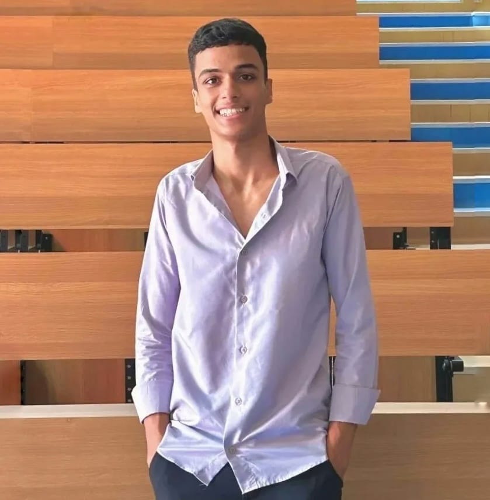

<table>
  <tr>
    <td width="62%" valign="middle">
      <h1 style="font-size: 3.5em; margin: 0 0 10px 0; color: #1C2839;">Adel Ibrahim</h1>
      <h2 style="font-size: 1.8em; margin: 0 0 20px 0; color: #2D3D52;">AI Products, Built Like a Startup</h2>
      
Building open-source AI systems for education, collaboration, and professional growth.

      

        
        
        
      

    </td>
    <td width="38%" align="center" valign="middle">
      
    </td>
  </tr>
</table>

## Trust Signal

<table>
  <tr>
    <td width="68%" valign="top">
      <h3 style="color: #1C2839;">First Place Winner — Computer Science & Engineering Projects Exhibition 2026</h3>
      
<strong>Winning Product:</strong> ERTH Matching

      

        
        
      

    </td>
  </tr>
</table>

## Featured Projects

<table>
  <tr>
    <td width="100%" valign="top">
      <h3 style="color: #1C2839;">ERTH Matching</h3>
      
Smart skill-based collaboration platform for student projects at New Mansoura University.

      

        
        
      

      <ul style="color: #415169;">
        <li>AI-powered teammate matching engine evaluating 5+ compatibility factors</li>
        <li>Real-time team workspaces with Kanban boards & chat</li>
        <li>70+ API endpoints, admin skill heatmaps, multilingual support</li>
      </ul>
    </td>
  </tr>
</table>

<table>
  <tr>
    <td width="100%" valign="top">
      <h3 style="color: #1C2839;">Erudios</h3>
      
Open-source personalized AI curriculum builder that answers "what to learn next".

      

        
        
        
      

      <ul style="color: #415169;">
        <li>Pre-built dependency graph for 50+ AI/ML topics</li>
        <li>Multi-LLM router (Gemini + Groq + HuggingFace) with budget tracking</li>
        <li>Shared content cache, lazy generation, resource discovery</li>
      </ul>
    </td>
  </tr>
</table>

<table>
  <tr>
    <td width="100%" valign="top">
      <h3 style="color: #1C2839;">Corpus</h3>
      
Domain-specific language learning for high-stakes professional communication.

      

        
        
      

      <ul style="color: #415169;">
        <li>RAG pipeline with bi-encoder recall & cross-encoder reranking</li>
        <li>108-concept ontology across AI & software engineering</li>
        <li>Interactive AI coach roleplay simulator</li>
      </ul>
    </td>
  </tr>
</table>

## Tech Stack

<table>
  <tr>
    <td width="25%" valign="top">
      <h4 style="color: #1C2839;">AI / ML</h4>
      

         
         
        
      

    </td>
    <td width="25%" valign="top">
      <h4 style="color: #1C2839;">Backend</h4>
      

         
        
      

    </td>
    <td width="25%" valign="top">
      <h4 style="color: #1C2839;">Frontend</h4>
      

         
         
        
      

    </td>
    <td width="25%" valign="top">
      <h4 style="color: #1C2839;">Infra / Data</h4>
      

         
         
         
        
      

    </td>
  </tr>
</table>

## GitHub Stats

  
  
  

## Connect

<table>
  <tr>
    <td width="65%" valign="middle">
      <h3 style="color: #1C2839;">Let's Build Useful AI</h3>
      
Interested in AI products, open-source systems, or collaboration? Let's connect.

    </td>
    <td width="35%" align="center" valign="middle">
        
      
    </td>
  </tr>
</table>
